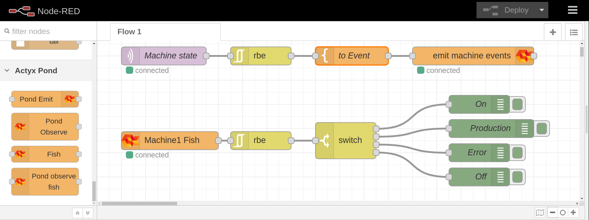

# Node-RED Actyx Pond V2 integration

Node-red contribution to write you fish as nodes or emit events to ActyxOS

## installation:

1. Install in node red: `Menu` -> `Manage Pallet` -> `Install` -> `@actyx-contrib/node-red-contrib-actyx-pond`

2. Install in node-project: `npm install @actyx-contrib/node-red-contrib-actyx-pond`

## New Nodes

Fore new nodes are added to node-red in the 'Actyx Pond' Category

- Pond Emit
- Fish
- Pond Observe
- Pond Observe

---

## Pond Emit:

> Behaves like `Pond.emit(tag, payload).`

`msg.payload` is used as the payload of the published event.

If the `tags` are defined as mustache template it is rendered with the data in the `msg` _(e.g.: {{topic}} machine:{{payload.name}})_

You will finde more details in the **Node Help**.

## Fish:

> Behaves like `Fish<State, Event>`

Fish definition for `Pond Observe Fish`

_Except from the FishId.version, all fields support mustache as template engine \(e.g.: Name: \{\{payload.name\}\}\)_

You will finde more details in the **Node Help**.

## Pond Observe Fish:

> Behaves like `Pond.observe(Fish(parameter), onStateChanged).`

Observe the `fish` in the input signal and emit signals when the `fish state` changes.

_Use the `Fish` node to inject a fish property into the signal_

You will finde more details in the **Node Help**.

## Pond Observe:

> Behaves like `Pond.observe(Fish, onStateChanged).`

Combines Fish and observe Fish in one node. This Node do not support inputs and can be used for singleton fish.

You will finde more details in the **Node Help**.
